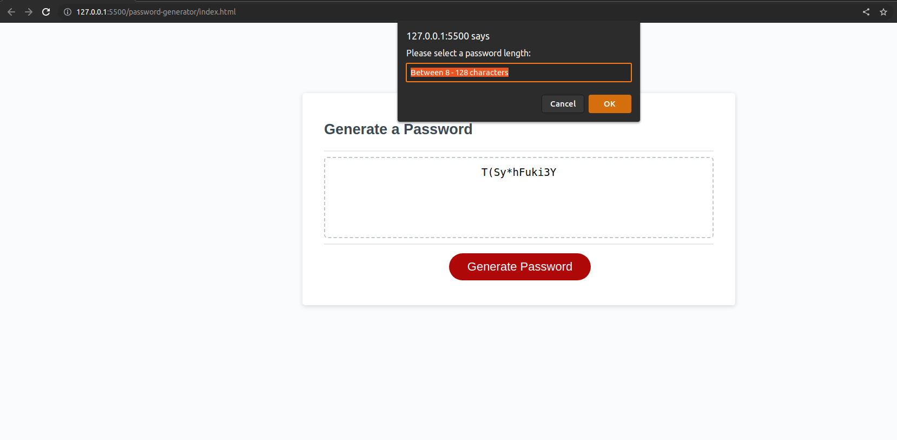

# Password Generator

## Screenshot

## Links
GitHub: https://github.com/Yoonbacca/password-generator

Live Page: https://yoonbacca.github.io/password-generator

## Description
This is a simple password generator website built using starter code from NW University's Fullstack Coding Bootcamp. This project is an reflection of all the JS concepts I have learned so far. An object called 'password' is declared globally. This houses all of the properties selected for the user's password. A global variable 'chars' is also stored as an empty string. This will house all the possible characters the generator can use. The password will generate once a sequence of functions is called after the 'Generate Password' button is pressed. I've listed the sequential order of the functions below:

#### Password Length
Clicking the "Generate a Password" button will initiate the passLength() function. This will pull up a prompt window which will instruct the user to select 8-128 characters. If the user selects an invalid number or inputs text, it will call the passwordLength() function again. This will loop until an acceptable number is input by the user. From there, the passLowercase() function is called.

#### Password Lowercase, UpperCase, and Numbers
passLowercase() will pullup a simple confirm window which will set the value of lowercase as 'true' when 'OK' is selected. This will be stored in the password object. It also adds the string "abcd...xyz" into the global variable 'chars'. It will then call upon passUppercase(), which functions identically with its respective boolean value and string value. Once passUpperCase() is done, it will then move onto passNumbers(), another almost identical function.

#### Password Special
After all three of the above functions are called, passSpecial() is called. This functions similarly, but it also has an additional if/else statement which will check if 'chars' has a length of 0. If this is true, then it will instruct the user to select at least one criteria, then call on passLowerCase(). This ensures that the user will not be able to generate a function without at least selecting one password property as 'true'. 

I originally used the booleans stored in the password object for validation, but found that monitoring the length of 'chars' accomplished the same thing with less code.

Once the user selects either 'OK' or 'Cancel' with at least one of the password properties set as 'true', then the writePassword() function is called

#### Write Password
First, a variable, passwordText is declared to be put inside the HTML element with the id, password. Then I declare an empty string for the password, named 'pass'. From there, a for loop will run the same amount of iterations as the length set by the user. This will generate a random number based on the length of the 'chars' variable. Once the number is selected, the loop is then instructed to add a one character substring to the end of the variable 'pass'. The for loop will then repeat this until the selected length is reached.

'passwordText' will then be assigned the value of 'pass', which will then show up on the page for the user to use at their discretion.

## How to Install and Run the Project 
You can either clone the repo and preview index.html within an IDE or access the page at https://yoonbacca.github.io/password-generator

## How to Use the Project
As my skills develop, this page will incorporate tools like jQuery to make the UI/UX more in-line with modern standards.

## Credits
This project was created from scratch by Yoon-Jae Kim. All comments and edits by me. Techniques learned from NW Coding Bootcamp.
